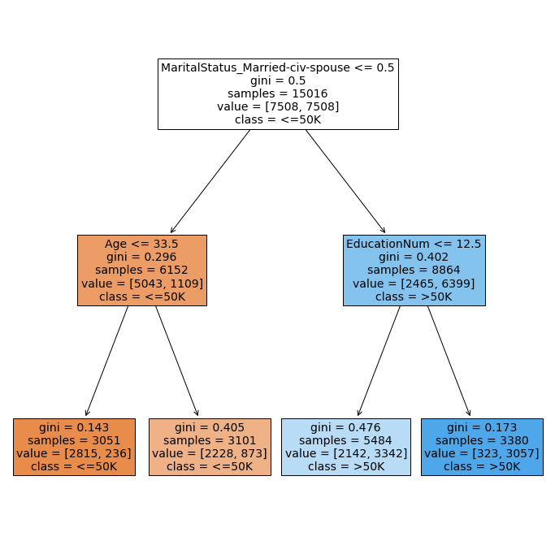
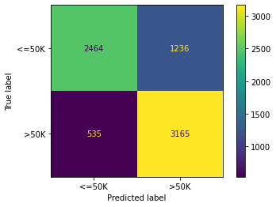

## Decision Trees with Python

### Load the *Adult Census* Dataset


```python
import pandas as pd

adult_train = pd.read_csv('data/adult_train.csv')
adult_train.head()
```


<div>
<style scoped>
    .dataframe tbody tr th:only-of-type {
        vertical-align: middle;
    }

    .dataframe tbody tr th {
        vertical-align: top;
    }

    .dataframe thead th {
        text-align: right;
    }
</style>
<table border="1" class="dataframe">
  <thead>
    <tr style="text-align: right;">
      <th></th>
      <th>Age</th>
      <th>WorkClass</th>
      <th>Fnlwgt</th>
      <th>Education</th>
      <th>EducationNum</th>
      <th>MaritalStatus</th>
      <th>Occupation</th>
      <th>Relationship</th>
      <th>Race</th>
      <th>Sex</th>
      <th>CapitalGain</th>
      <th>CapitalLoss</th>
      <th>HoursPerWeek</th>
      <th>NativeCountry</th>
      <th>Label</th>
    </tr>
  </thead>
  <tbody>
    <tr>
      <th>0</th>
      <td>20</td>
      <td>Private</td>
      <td>30035</td>
      <td>Assoc-acdm</td>
      <td>12</td>
      <td>Never-married</td>
      <td>Sales</td>
      <td>Own-child</td>
      <td>White</td>
      <td>Female</td>
      <td>0</td>
      <td>0</td>
      <td>40</td>
      <td>United-States</td>
      <td>&lt;=50K</td>
    </tr>
    <tr>
      <th>1</th>
      <td>22</td>
      <td>Private</td>
      <td>141297</td>
      <td>Some-college</td>
      <td>10</td>
      <td>Never-married</td>
      <td>Tech-support</td>
      <td>Own-child</td>
      <td>White</td>
      <td>Male</td>
      <td>0</td>
      <td>0</td>
      <td>40</td>
      <td>United-States</td>
      <td>&lt;=50K</td>
    </tr>
    <tr>
      <th>2</th>
      <td>63</td>
      <td>Private</td>
      <td>440607</td>
      <td>Preschool</td>
      <td>1</td>
      <td>Married-civ-spouse</td>
      <td>Prof-specialty</td>
      <td>Husband</td>
      <td>Other</td>
      <td>Male</td>
      <td>0</td>
      <td>0</td>
      <td>30</td>
      <td>Mexico</td>
      <td>&lt;=50K</td>
    </tr>
    <tr>
      <th>3</th>
      <td>32</td>
      <td>Private</td>
      <td>165949</td>
      <td>Bachelors</td>
      <td>13</td>
      <td>Divorced</td>
      <td>Machine-op-inspct</td>
      <td>Not-in-family</td>
      <td>White</td>
      <td>Female</td>
      <td>0</td>
      <td>1590</td>
      <td>42</td>
      <td>United-States</td>
      <td>&lt;=50K</td>
    </tr>
    <tr>
      <th>4</th>
      <td>36</td>
      <td>Private</td>
      <td>139743</td>
      <td>Some-college</td>
      <td>10</td>
      <td>Widowed</td>
      <td>Prof-specialty</td>
      <td>Own-child</td>
      <td>White</td>
      <td>Female</td>
      <td>0</td>
      <td>0</td>
      <td>40</td>
      <td>United-States</td>
      <td>&lt;=50K</td>
    </tr>
  </tbody>
</table>
</div>


### Get *Race* Value Counts


```python
# Get the counts of categorical levels
adult_train['Race'].value_counts(dropna = False)
```


    Race
    White                 13126
    Black                  1219
    Asian-Pac-Islander      462
    Amer-Indian-Eskimo      116
    Other                    93
    Name: count, dtype: int64


### One-Hot Encoding


```python
# Use the get_dummies() function to one-hot encode
race_encoding = pd.get_dummies(adult_train['Race'])
race_encoding.head()
```


<div>
<style scoped>
    .dataframe tbody tr th:only-of-type {
        vertical-align: middle;
    }

    .dataframe tbody tr th {
        vertical-align: top;
    }

    .dataframe thead th {
        text-align: right;
    }
</style>
<table border="1" class="dataframe">
  <thead>
    <tr style="text-align: right;">
      <th></th>
      <th>Amer-Indian-Eskimo</th>
      <th>Asian-Pac-Islander</th>
      <th>Black</th>
      <th>Other</th>
      <th>White</th>
    </tr>
  </thead>
  <tbody>
    <tr>
      <th>0</th>
      <td>False</td>
      <td>False</td>
      <td>False</td>
      <td>False</td>
      <td>True</td>
    </tr>
    <tr>
      <th>1</th>
      <td>False</td>
      <td>False</td>
      <td>False</td>
      <td>False</td>
      <td>True</td>
    </tr>
    <tr>
      <th>2</th>
      <td>False</td>
      <td>False</td>
      <td>False</td>
      <td>True</td>
      <td>False</td>
    </tr>
    <tr>
      <th>3</th>
      <td>False</td>
      <td>False</td>
      <td>False</td>
      <td>False</td>
      <td>True</td>
    </tr>
    <tr>
      <th>4</th>
      <td>False</td>
      <td>False</td>
      <td>False</td>
      <td>False</td>
      <td>True</td>
    </tr>
  </tbody>
</table>
</div>


### One-Hot Encoding with Prefix


```python
# Use the get_dummies() function to one-hot encode with a prefix
race_encoding = pd.get_dummies(adult_train['Race'], prefix = 'Race')
race_encoding.head()
```


<div>
<style scoped>
    .dataframe tbody tr th:only-of-type {
        vertical-align: middle;
    }

    .dataframe tbody tr th {
        vertical-align: top;
    }

    .dataframe thead th {
        text-align: right;
    }
</style>
<table border="1" class="dataframe">
  <thead>
    <tr style="text-align: right;">
      <th></th>
      <th>Race_Amer-Indian-Eskimo</th>
      <th>Race_Asian-Pac-Islander</th>
      <th>Race_Black</th>
      <th>Race_Other</th>
      <th>Race_White</th>
    </tr>
  </thead>
  <tbody>
    <tr>
      <th>0</th>
      <td>False</td>
      <td>False</td>
      <td>False</td>
      <td>False</td>
      <td>True</td>
    </tr>
    <tr>
      <th>1</th>
      <td>False</td>
      <td>False</td>
      <td>False</td>
      <td>False</td>
      <td>True</td>
    </tr>
    <tr>
      <th>2</th>
      <td>False</td>
      <td>False</td>
      <td>False</td>
      <td>True</td>
      <td>False</td>
    </tr>
    <tr>
      <th>3</th>
      <td>False</td>
      <td>False</td>
      <td>False</td>
      <td>False</td>
      <td>True</td>
    </tr>
    <tr>
      <th>4</th>
      <td>False</td>
      <td>False</td>
      <td>False</td>
      <td>False</td>
      <td>True</td>
    </tr>
  </tbody>
</table>
</div>


### One-Hot Encode Multiple Features


```python
# Create a ist of feature to one-hot encode
cat_features = ['Race', 'Sex']

# One-hot encode multiple features
encoded_train = pd.get_dummies(adult_train, prefix = cat_features, columns = cat_features)
encoded_train.head()
```


<div>
<style scoped>
    .dataframe tbody tr th:only-of-type {
        vertical-align: middle;
    }

    .dataframe tbody tr th {
        vertical-align: top;
    }

    .dataframe thead th {
        text-align: right;
    }
</style>
<table border="1" class="dataframe">
  <thead>
    <tr style="text-align: right;">
      <th></th>
      <th>Age</th>
      <th>WorkClass</th>
      <th>Fnlwgt</th>
      <th>Education</th>
      <th>EducationNum</th>
      <th>MaritalStatus</th>
      <th>Occupation</th>
      <th>Relationship</th>
      <th>CapitalGain</th>
      <th>CapitalLoss</th>
      <th>HoursPerWeek</th>
      <th>NativeCountry</th>
      <th>Label</th>
      <th>Race_Amer-Indian-Eskimo</th>
      <th>Race_Asian-Pac-Islander</th>
      <th>Race_Black</th>
      <th>Race_Other</th>
      <th>Race_White</th>
      <th>Sex_Female</th>
      <th>Sex_Male</th>
    </tr>
  </thead>
  <tbody>
    <tr>
      <th>0</th>
      <td>20</td>
      <td>Private</td>
      <td>30035</td>
      <td>Assoc-acdm</td>
      <td>12</td>
      <td>Never-married</td>
      <td>Sales</td>
      <td>Own-child</td>
      <td>0</td>
      <td>0</td>
      <td>40</td>
      <td>United-States</td>
      <td>&lt;=50K</td>
      <td>False</td>
      <td>False</td>
      <td>False</td>
      <td>False</td>
      <td>True</td>
      <td>True</td>
      <td>False</td>
    </tr>
    <tr>
      <th>1</th>
      <td>22</td>
      <td>Private</td>
      <td>141297</td>
      <td>Some-college</td>
      <td>10</td>
      <td>Never-married</td>
      <td>Tech-support</td>
      <td>Own-child</td>
      <td>0</td>
      <td>0</td>
      <td>40</td>
      <td>United-States</td>
      <td>&lt;=50K</td>
      <td>False</td>
      <td>False</td>
      <td>False</td>
      <td>False</td>
      <td>True</td>
      <td>False</td>
      <td>True</td>
    </tr>
    <tr>
      <th>2</th>
      <td>63</td>
      <td>Private</td>
      <td>440607</td>
      <td>Preschool</td>
      <td>1</td>
      <td>Married-civ-spouse</td>
      <td>Prof-specialty</td>
      <td>Husband</td>
      <td>0</td>
      <td>0</td>
      <td>30</td>
      <td>Mexico</td>
      <td>&lt;=50K</td>
      <td>False</td>
      <td>False</td>
      <td>False</td>
      <td>True</td>
      <td>False</td>
      <td>False</td>
      <td>True</td>
    </tr>
    <tr>
      <th>3</th>
      <td>32</td>
      <td>Private</td>
      <td>165949</td>
      <td>Bachelors</td>
      <td>13</td>
      <td>Divorced</td>
      <td>Machine-op-inspct</td>
      <td>Not-in-family</td>
      <td>0</td>
      <td>1590</td>
      <td>42</td>
      <td>United-States</td>
      <td>&lt;=50K</td>
      <td>False</td>
      <td>False</td>
      <td>False</td>
      <td>False</td>
      <td>True</td>
      <td>True</td>
      <td>False</td>
    </tr>
    <tr>
      <th>4</th>
      <td>36</td>
      <td>Private</td>
      <td>139743</td>
      <td>Some-college</td>
      <td>10</td>
      <td>Widowed</td>
      <td>Prof-specialty</td>
      <td>Own-child</td>
      <td>0</td>
      <td>0</td>
      <td>40</td>
      <td>United-States</td>
      <td>&lt;=50K</td>
      <td>False</td>
      <td>False</td>
      <td>False</td>
      <td>False</td>
      <td>True</td>
      <td>True</td>
      <td>False</td>
    </tr>
  </tbody>
</table>
</div>


### Prepare the Features


```python
# Prepare data for machine learning
all_features = ['Age', 'EducationNum', 'MaritalStatus', 'HoursPerWeek']

# Select the above features and one-hot encode MaritalStatus
adult_X = pd.get_dummies(adult_train[all_features], 
                         prefix = 'MaritalStatus', 
                         columns = ['MaritalStatus'])
adult_X.head()
```


<div>
<style scoped>
    .dataframe tbody tr th:only-of-type {
        vertical-align: middle;
    }

    .dataframe tbody tr th {
        vertical-align: top;
    }

    .dataframe thead th {
        text-align: right;
    }
</style>
<table border="1" class="dataframe">
  <thead>
    <tr style="text-align: right;">
      <th></th>
      <th>Age</th>
      <th>EducationNum</th>
      <th>HoursPerWeek</th>
      <th>MaritalStatus_Divorced</th>
      <th>MaritalStatus_Married-AF-spouse</th>
      <th>MaritalStatus_Married-civ-spouse</th>
      <th>MaritalStatus_Married-spouse-absent</th>
      <th>MaritalStatus_Never-married</th>
      <th>MaritalStatus_Separated</th>
      <th>MaritalStatus_Widowed</th>
    </tr>
  </thead>
  <tbody>
    <tr>
      <th>0</th>
      <td>20</td>
      <td>12</td>
      <td>40</td>
      <td>False</td>
      <td>False</td>
      <td>False</td>
      <td>False</td>
      <td>True</td>
      <td>False</td>
      <td>False</td>
    </tr>
    <tr>
      <th>1</th>
      <td>22</td>
      <td>10</td>
      <td>40</td>
      <td>False</td>
      <td>False</td>
      <td>False</td>
      <td>False</td>
      <td>True</td>
      <td>False</td>
      <td>False</td>
    </tr>
    <tr>
      <th>2</th>
      <td>63</td>
      <td>1</td>
      <td>30</td>
      <td>False</td>
      <td>False</td>
      <td>True</td>
      <td>False</td>
      <td>False</td>
      <td>False</td>
      <td>False</td>
    </tr>
    <tr>
      <th>3</th>
      <td>32</td>
      <td>13</td>
      <td>42</td>
      <td>True</td>
      <td>False</td>
      <td>False</td>
      <td>False</td>
      <td>False</td>
      <td>False</td>
      <td>False</td>
    </tr>
    <tr>
      <th>4</th>
      <td>36</td>
      <td>10</td>
      <td>40</td>
      <td>False</td>
      <td>False</td>
      <td>False</td>
      <td>False</td>
      <td>False</td>
      <td>False</td>
      <td>True</td>
    </tr>
  </tbody>
</table>
</div>


### Prepare the Labels


```python
from sklearn.preprocessing import LabelEncoder

# Encode labels
label_encoder = LabelEncoder()
adult_y = label_encoder.fit_transform(adult_train['Label'])

print(label_encoder.classes_)
print(adult_y)
```

    ['<=50K' '>50K']
    [0 0 0 ... 1 1 1]
    

### Training a Model


```python
from sklearn.tree import DecisionTreeClassifier

# Train a CART-like classification tree
tree_1 = DecisionTreeClassifier(min_samples_leaf = 3000, random_state = 12345)

tree_1.fit(adult_X, adult_y)
```


<style>#sk-container-id-1 {color: black;}#sk-container-id-1 pre{padding: 0;}#sk-container-id-1 div.sk-toggleable {background-color: white;}#sk-container-id-1 label.sk-toggleable__label {cursor: pointer;display: block;width: 100%;margin-bottom: 0;padding: 0.3em;box-sizing: border-box;text-align: center;}#sk-container-id-1 label.sk-toggleable__label-arrow:before {content: "▸";float: left;margin-right: 0.25em;color: #696969;}#sk-container-id-1 label.sk-toggleable__label-arrow:hover:before {color: black;}#sk-container-id-1 div.sk-estimator:hover label.sk-toggleable__label-arrow:before {color: black;}#sk-container-id-1 div.sk-toggleable__content {max-height: 0;max-width: 0;overflow: hidden;text-align: left;background-color: #f0f8ff;}#sk-container-id-1 div.sk-toggleable__content pre {margin: 0.2em;color: black;border-radius: 0.25em;background-color: #f0f8ff;}#sk-container-id-1 input.sk-toggleable__control:checked~div.sk-toggleable__content {max-height: 200px;max-width: 100%;overflow: auto;}#sk-container-id-1 input.sk-toggleable__control:checked~label.sk-toggleable__label-arrow:before {content: "▾";}#sk-container-id-1 div.sk-estimator input.sk-toggleable__control:checked~label.sk-toggleable__label {background-color: #d4ebff;}#sk-container-id-1 div.sk-label input.sk-toggleable__control:checked~label.sk-toggleable__label {background-color: #d4ebff;}#sk-container-id-1 input.sk-hidden--visually {border: 0;clip: rect(1px 1px 1px 1px);clip: rect(1px, 1px, 1px, 1px);height: 1px;margin: -1px;overflow: hidden;padding: 0;position: absolute;width: 1px;}#sk-container-id-1 div.sk-estimator {font-family: monospace;background-color: #f0f8ff;border: 1px dotted black;border-radius: 0.25em;box-sizing: border-box;margin-bottom: 0.5em;}#sk-container-id-1 div.sk-estimator:hover {background-color: #d4ebff;}#sk-container-id-1 div.sk-parallel-item::after {content: "";width: 100%;border-bottom: 1px solid gray;flex-grow: 1;}#sk-container-id-1 div.sk-label:hover label.sk-toggleable__label {background-color: #d4ebff;}#sk-container-id-1 div.sk-serial::before {content: "";position: absolute;border-left: 1px solid gray;box-sizing: border-box;top: 0;bottom: 0;left: 50%;z-index: 0;}#sk-container-id-1 div.sk-serial {display: flex;flex-direction: column;align-items: center;background-color: white;padding-right: 0.2em;padding-left: 0.2em;position: relative;}#sk-container-id-1 div.sk-item {position: relative;z-index: 1;}#sk-container-id-1 div.sk-parallel {display: flex;align-items: stretch;justify-content: center;background-color: white;position: relative;}#sk-container-id-1 div.sk-item::before, #sk-container-id-1 div.sk-parallel-item::before {content: "";position: absolute;border-left: 1px solid gray;box-sizing: border-box;top: 0;bottom: 0;left: 50%;z-index: -1;}#sk-container-id-1 div.sk-parallel-item {display: flex;flex-direction: column;z-index: 1;position: relative;background-color: white;}#sk-container-id-1 div.sk-parallel-item:first-child::after {align-self: flex-end;width: 50%;}#sk-container-id-1 div.sk-parallel-item:last-child::after {align-self: flex-start;width: 50%;}#sk-container-id-1 div.sk-parallel-item:only-child::after {width: 0;}#sk-container-id-1 div.sk-dashed-wrapped {border: 1px dashed gray;margin: 0 0.4em 0.5em 0.4em;box-sizing: border-box;padding-bottom: 0.4em;background-color: white;}#sk-container-id-1 div.sk-label label {font-family: monospace;font-weight: bold;display: inline-block;line-height: 1.2em;}#sk-container-id-1 div.sk-label-container {text-align: center;}#sk-container-id-1 div.sk-container {/* jupyter's `normalize.less` sets `[hidden] { display: none; }` but bootstrap.min.css set `[hidden] { display: none !important; }` so we also need the `!important` here to be able to override the default hidden behavior on the sphinx rendered scikit-learn.org. See: https://github.com/scikit-learn/scikit-learn/issues/21755 */display: inline-block !important;position: relative;}#sk-container-id-1 div.sk-text-repr-fallback {display: none;}</style><div id="sk-container-id-1" class="sk-top-container"><div class="sk-text-repr-fallback"><pre>DecisionTreeClassifier(min_samples_leaf=3000, random_state=12345)</pre><b>In a Jupyter environment, please rerun this cell to show the HTML representation or trust the notebook. <br />On GitHub, the HTML representation is unable to render, please try loading this page with nbviewer.org.</b></div><div class="sk-container" hidden><div class="sk-item"><div class="sk-estimator sk-toggleable"><input class="sk-toggleable__control sk-hidden--visually" id="sk-estimator-id-1" type="checkbox" checked><label for="sk-estimator-id-1" class="sk-toggleable__label sk-toggleable__label-arrow">DecisionTreeClassifier</label><div class="sk-toggleable__content"><pre>DecisionTreeClassifier(min_samples_leaf=3000, random_state=12345)</pre></div></div></div></div></div>


### Visualizing the Model


```python
import matplotlib.pyplot as plt
from sklearn.tree import plot_tree

# Set the size of the tree visual to be 12 by 12 inches
plt.figure(figsize=(12,12))

# Create a visual representions of the tree
plot_1 = plot_tree(tree_1, feature_names = list(adult_X.columns), fontsize = 14,
                   class_names = list(label_encoder.classes_), filled = True)
```


    

    


### Load the Testing Dataset


```python
# Load the Adult Census test dataset
adult_test = pd.read_csv('data/adult_test.csv')
adult_test.head()
```


<div>
<style scoped>
    .dataframe tbody tr th:only-of-type {
        vertical-align: middle;
    }

    .dataframe tbody tr th {
        vertical-align: top;
    }

    .dataframe thead th {
        text-align: right;
    }
</style>
<table border="1" class="dataframe">
  <thead>
    <tr style="text-align: right;">
      <th></th>
      <th>Age</th>
      <th>WorkClass</th>
      <th>Fnlwgt</th>
      <th>Education</th>
      <th>EducationNum</th>
      <th>MaritalStatus</th>
      <th>Occupation</th>
      <th>Relationship</th>
      <th>Race</th>
      <th>Sex</th>
      <th>CapitalGain</th>
      <th>CapitalLoss</th>
      <th>HoursPerWeek</th>
      <th>NativeCountry</th>
      <th>Label</th>
    </tr>
  </thead>
  <tbody>
    <tr>
      <th>0</th>
      <td>32</td>
      <td>Private</td>
      <td>185820</td>
      <td>Bachelors</td>
      <td>13</td>
      <td>Never-married</td>
      <td>Prof-specialty</td>
      <td>Not-in-family</td>
      <td>Black</td>
      <td>Female</td>
      <td>0</td>
      <td>0</td>
      <td>40</td>
      <td>Trinadad&amp;Tobago</td>
      <td>&lt;=50K</td>
    </tr>
    <tr>
      <th>1</th>
      <td>34</td>
      <td>Private</td>
      <td>122749</td>
      <td>Some-college</td>
      <td>10</td>
      <td>Married-civ-spouse</td>
      <td>Handlers-cleaners</td>
      <td>Husband</td>
      <td>White</td>
      <td>Male</td>
      <td>0</td>
      <td>0</td>
      <td>32</td>
      <td>Trinadad&amp;Tobago</td>
      <td>&lt;=50K</td>
    </tr>
    <tr>
      <th>2</th>
      <td>20</td>
      <td>Private</td>
      <td>117476</td>
      <td>Some-college</td>
      <td>10</td>
      <td>Never-married</td>
      <td>Handlers-cleaners</td>
      <td>Own-child</td>
      <td>White</td>
      <td>Male</td>
      <td>0</td>
      <td>0</td>
      <td>40</td>
      <td>Trinadad&amp;Tobago</td>
      <td>&lt;=50K</td>
    </tr>
    <tr>
      <th>3</th>
      <td>36</td>
      <td>Private</td>
      <td>185692</td>
      <td>7th-8th</td>
      <td>4</td>
      <td>Married-civ-spouse</td>
      <td>Farming-fishing</td>
      <td>Husband</td>
      <td>White</td>
      <td>Male</td>
      <td>0</td>
      <td>0</td>
      <td>35</td>
      <td>Trinadad&amp;Tobago</td>
      <td>&lt;=50K</td>
    </tr>
    <tr>
      <th>4</th>
      <td>73</td>
      <td>Private</td>
      <td>88594</td>
      <td>HS-grad</td>
      <td>9</td>
      <td>Divorced</td>
      <td>Exec-managerial</td>
      <td>Not-in-family</td>
      <td>White</td>
      <td>Female</td>
      <td>0</td>
      <td>0</td>
      <td>35</td>
      <td>Trinadad&amp;Tobago</td>
      <td>&lt;=50K</td>
    </tr>
  </tbody>
</table>
</div>


### Preparing the Test Features


```python
# Use the same training features and one-hot encode
adult_test_X = pd.get_dummies(adult_test[all_features], 
                              prefix = 'MaritalStatus', 
                              columns = ['MaritalStatus'])
adult_test_X.head()
```


<div>
<style scoped>
    .dataframe tbody tr th:only-of-type {
        vertical-align: middle;
    }

    .dataframe tbody tr th {
        vertical-align: top;
    }

    .dataframe thead th {
        text-align: right;
    }
</style>
<table border="1" class="dataframe">
  <thead>
    <tr style="text-align: right;">
      <th></th>
      <th>Age</th>
      <th>EducationNum</th>
      <th>HoursPerWeek</th>
      <th>MaritalStatus_Divorced</th>
      <th>MaritalStatus_Married-AF-spouse</th>
      <th>MaritalStatus_Married-civ-spouse</th>
      <th>MaritalStatus_Married-spouse-absent</th>
      <th>MaritalStatus_Never-married</th>
      <th>MaritalStatus_Separated</th>
      <th>MaritalStatus_Widowed</th>
    </tr>
  </thead>
  <tbody>
    <tr>
      <th>0</th>
      <td>32</td>
      <td>13</td>
      <td>40</td>
      <td>False</td>
      <td>False</td>
      <td>False</td>
      <td>False</td>
      <td>True</td>
      <td>False</td>
      <td>False</td>
    </tr>
    <tr>
      <th>1</th>
      <td>34</td>
      <td>10</td>
      <td>32</td>
      <td>False</td>
      <td>False</td>
      <td>True</td>
      <td>False</td>
      <td>False</td>
      <td>False</td>
      <td>False</td>
    </tr>
    <tr>
      <th>2</th>
      <td>20</td>
      <td>10</td>
      <td>40</td>
      <td>False</td>
      <td>False</td>
      <td>False</td>
      <td>False</td>
      <td>True</td>
      <td>False</td>
      <td>False</td>
    </tr>
    <tr>
      <th>3</th>
      <td>36</td>
      <td>4</td>
      <td>35</td>
      <td>False</td>
      <td>False</td>
      <td>True</td>
      <td>False</td>
      <td>False</td>
      <td>False</td>
      <td>False</td>
    </tr>
    <tr>
      <th>4</th>
      <td>73</td>
      <td>9</td>
      <td>35</td>
      <td>True</td>
      <td>False</td>
      <td>False</td>
      <td>False</td>
      <td>False</td>
      <td>False</td>
      <td>False</td>
    </tr>
  </tbody>
</table>
</div>


### Making Predictions


```python
# Encode the labels of the test dataset
adult_test_y = label_encoder.transform(adult_test['Label'])

# Make predictions on the test dataset
test_preds = tree_1.predict(adult_test_X)

print(test_preds)
```

    [0 1 0 ... 1 1 0]
    

### How Well Did the Model Learn?


```python
from sklearn.metrics import confusion_matrix, ConfusionMatrixDisplay

# What is the overall accuracy on the test dataset?
print(f'Test dataset accuracy: {tree_1.score(adult_test_X, adult_test_y):.4f}')

# Display a confusion matrix
cm = confusion_matrix(adult_test_y, test_preds)
cmd = ConfusionMatrixDisplay(cm, display_labels = label_encoder.classes_)
cmd.plot();
```

    Test dataset accuracy: 0.7607
    


    

    

